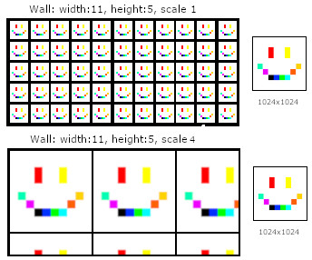

</p>

A first person 3D game made in C with SDL2 and no hardware acceleration or 3rd party 3D Libraries.
Writen in accordance to the [Norm](TheNorm.md).
* [Features](#features)
* [Installation](#installation)
* [Controls](#controls)
* [Engine](#engine)
* [Map File](#map-file)
* [Textures](#textures)
* [BXPM](#bxpm-image-format)
* [Events](#events)
* [Benchmark](#benchmark)
* [Stats](#game-stats)

</p>

---

## Features

- 360 degree seamless skybox.
- Bullet holes left on walls after shooting.
- A Store where weapons, ammo, armour and player upgrades can be bought.
- Rifts (Portals) that spawn entities.
- 2 Game modes, Story and Endless.
- Multithreading.
- Map events, flickering light, moving doors etc.
- Clickable or shootable buttons and position triggers.
- User settings, Window size, FOV, Difficulty etc.
- Wall collision and wall slide.
- AI Dodge/Danger.
- Many more...

---

## Installation

There are 3 options:

If you just want to play the game, does not need compiling.
> [Ready to play for Mac!](https://drive.google.com/uc?export=download&id=1J6ujchWjAcnpM-dIRYTxoltTOma715Hi "Google Drive Mac Version")

> [Ready to play for Win!](https://drive.google.com/uc?export=download&id=1nbvBJ3ODNWr-jG7rfbAbiHkspc88MzMb "Google Drive Windows Version")
> **Note:** Windows version of doom is missing a library and may not work atm, fixing as soon as possible.

Or if you want the source code.
```sh
git clone https://github.com/Epicurius/Doom-Not-Doom.git
cd Doom-not-Doom && make
./doom resources/MAPS/Showcase.dnds
```
Or try it with extra features like a map_editor by [JONY97](https://github.com/J0NY97), check it out [here](https://github.com/J0NY97/doom_nukem.git).
```sh
git clone --recurse-submodule https://github.com/J0NY97/doom_nukem.git
cd doom_nukem && make
./launcher
```
> **Note:** This version of doom is a bit older.
---

## Controls
```
WASD/Arrow Keys	- Move		
Space		- Jump		
Mouse		- Look around
Shift		- Sprint		
Control		- Crouch		
Left click	- Shoot		
E		- Use		
Hold Tab	- Show map	
Scroll Wheel	- Zoom map	
ESC/Q		- Quit		
+/-		- Volume		
`		- Unstuck player
```

---

##	Engine

Short introduction on how the engine works.
* [Engine Flow](#engine-flow)
* [Map Drawing](#map-drawing)
* [Skybox](#skybox)
* [AI](#entitites)
* [Shooting](#shooting)
* [Collision Detection](#collision-detection)

##### Engine Flow
When designing and building the game engine my priority was performance (FPS) over features.
In my mind a game with many features but low performance is worse that the opposite,
so with the constraints of no hardware acceleration (GPU) and no 3rd party 3D Library (OpenGl)
multithreading (pthreads) was my best option.

</p>

```ruby
1  - Game is launched.
2  - Checking all passed arguments, if not given sets default values.
3  - Parses the given map file.
4  - Validates the map values and corrects any it can, else program terminates.
5  - Inits everything needed for the game to run.
6  - Creates and executes texture parsing threads, wait for all to be ready.
7  - While user has not quit or died:
	1  - Handles game mode specific event, e.g. spawning enemies, game rounds.
	2  - Handles map events, e.g. moving doors, light switches.
	3  - Precompute walls, values that can be calculated before drawing.
	4  - Precompute skybox, values that can be calculated before drawing.
	5  - Creates map drawing threads.
	6  - Precompute weapons, does it have ammo etc.
	7  - Precompute Entities, e.g. movement, aggression.
	8  - Precompute projectile, movement and collision.
	9  - Handel player collision detection.
	10 - Reads all user inputs.
	11 - Wait for all map drawing threads to be ready.
	12 - Draw all projectiles
	13 - Create and execute entity drawing threads.
	14 - Create and execute weapon drawing threads.
	15 - Draw HUD, e.g. ammo, health, armour amount.
	16 - If Tab is pressed draw minimap.
	17 - Calculate and update window title with FPS and calculate delta time.
	18 - Render frame to screen.
	19 - Check if user has paused or quit game.
8  - Free all allocated memory.
9  - Exit game.
```
</p>


##### Map Drawing
To maximize on performance the map surfaces are calculated first so that the screen can be split into width amount of vertical pieces.
Each vertical piece is self sufficient from start to end, which enabled them to render and draw on the same surface at the same time,
while the main thread can do tasks that don't require the screen surface, e.g. collision detection, precompute AI.
And when all map surfaces have been drawn no more calculations are needed for the rest of the rendering, e.g. Entity rendering.

The engine uses a z-buffer to determine when entities and projetile should be draw. The z-buffer is set each frame when the map surfaces are drawn but not used.
This is because of the way the map is drawn, this means no compares are needed when drawing the map and eahc frame the z-buffer does not need to be reset.
Only projectiles nad entites use z-buffer to compare if each pixel should be drawn. The only down side to this method is that there is no simple way to implement render distance.

##### Map rendering on one thread, first monochrome then with texture.</center>


When rendering/drawing the map surfaces .e.g walls, floor and ceiling, a recursive approach is used.
each vertical segment starts with player sector wall, if the wall has a neighbor it calls itself with a reduced screen segment
(black part in the above gif) and start from the beginning.
When a solid wall is hit the engine draws the wall and starts to backtrack and drawing any see-through walls.

##### Skybox

Skybox rendering is similar to normal map rendering except for the "walls" of the skybox are not static.
The skybox box is a `10x10x10` box where the player is always in the middle, the box also moves with the player creating the illusion that there is a vast distance.

##### AI

Entities have 4 states **IDLE**, **MOVE**, **ATTACK**, **DEATH** static entities use only **IDLE**.
Animate/non-static entities have a detection radius and a view cone,
if their line of sight collides with the player they will get the state **MOVE**
and try to get into their attack range.
When the entity is inside their attack range they will get the state ATTACK and start attacking the player.
If the entities health drops below 1 the state will be set to DEATH and when all the death frames have been played the entity is removed.
During IDLE state, non static entities have a random chance of moving into a radom direction, and if an entity is attacking or pursuing a player while the players crosshair is on the entity the entity will try to move and dodge, to avoid getting shot.


Each entity frames are divided into the entity states and into FRAME and ANGLE.
Take for example the above image, it has move animation of 8 frames with each having 3 angles.
When moving every 120 degrees (360 / 3) around the entity will show a different frame angle.
If an entity has 1 angle the entity will always face the player.
So a entity frame coordinates can be derived from ```doom->eframes[ENTITY].pos[STATE][FRAME][ANGLE]```;

Entity presets can be found from inc/resources.h

##### Shooting

Shooting is very simple, when each entity is drawn if an entity pixel is the middle of the screen,
and the player has pressed left click then that entity has been shot.
No bullet collision detection algorithm is required.

##### Collision Detection

Collision detection has to keep track of velocity, position and sector, this makes collision detection a bit tricky.
It consists of 3 main parts:

```
Vertical_collision():
	Check for z axis collision, e.g. jump, fall.
	If possible apply gravity.
	Change z velocity appropriately.
```
```
Horizontal_collision():
	Check for x/y axis collision and sector changes.
	Set each visited sector to TRUE, to keep track.
	Check all walls in sector.
	If intersect portal, check for step height and start checking all neighboring sectors walls.
	If collision detected pass to slide_collision().
	Else keep original x/y velocity.
```
```
Slide_collision():
	Adjusts velocity so that an entity slides parallel with given wall.
	Checks x/y collision, if collision detected sets x and y velocity to 0.
	Else change x/y velocity appropriately.
```
When all collision detection has been checked, add velocity to entity position.
If entity position is not in original sector, find correct sector from visited sectors list. Otherwise kill.

---

##	Textures

Scaling of textures is preformed by taking the width and height of the wall
and dividing it into individual squares.
Each square is 1 unit, so if scale is 1 fit the wall texture in each square.
If scale is set to 4, 1/8 of the texture per square or 4x4 squares per texture.
Similar to [Texels](https://en.wikipedia.org/wiki/Texel_(graphics) "Wikipedia"), thou didn't know of it before making my texture scaling.
In hind site making separate width and height scale would have made scaling prettier.



This insures that the size of a texture does not matter when creating the map.
> **Note:** In the above example if the image where 512x512 the wall would look the same.
>	except for a bit more blurry.

---

## BXPM Image Format

The game required to have different light levels, for that to work each pixel of
a given texture had to brightened or darkened to achieve the desired effect.
Each frame all sectors screen pixels with a custom light level had to be calculated.
To improve performance BXPM image format was created.

BXPM is split into three parts:
```
Header:
	Size:		20 bytes.
	Type:		int32_t
	Content:	In order: width, height, color amount, pixel amount, pixel format.

Colors:
	Size:		Color amount * 32 bytes
	Type:		int32_t
	Content:	Each unique color in the image.

Pixels:
	Size:		Pixel amount * 16 bytes
	Type:		uint32_t
	Content:	Id of the corresponding color.
```
Which we save into a struct:
```c
typedef struct s_bxpm
{
	int32_t			w;			//Image width
	int32_t			h;			//Image height
	int32_t			bpp;		//Color bits
	int32_t			clr_nb;		//Unique color amount
	int32_t			pix_nb;		//Pixel amount
	uint32_t		*clr;		//Unique colors
	uint16_t		*pix:		//Pixels index
	uint32_t		**shade;	//Unique color shade
}					t_bxpm;		
```
This makes the BXPM file a lot smaller than a BMP, which also speeds up the parsing.
But now instead of calculating pixel amount we need only calculate the color amount.
We can do it at the start, and save each light level into uint32_t **shade,
which will occupy clr_nb * 32 bytes per unique light level, so during runtime no
light level calculations are done.
> **Note:** The images used where specificity edited to have as few unique colors as possible.

If you want to take a look at how it works the library is at root libs/libbxpm.
And in ./converter/ there is a bmp to bxpm converter. `./converter/run.sh FILE.bmp`


```c
//Visualization of the above (10x10)Image in BXPM format divided by commas, actual BXPM is not readable.
10,10,11,100,24,0xffffffff,0xff000000,0xff0032ff,0xff00ff00,0xff00fbff,0xffef00ff,0xffff6000,0xff00ffb5,0xffffd200, 0xffff0000,0xffffff00,0,0,0,0,0,0,0,0,0,0,0,0,0,0,0,0,0,0,0,0,0,0,0,9,0,0,10,0,0,0,0,0,0,9,0,0,10,0,0,0,0,0,0,0,0,0,0,0,0,0,0,7,0,0,0,0,0,0,8,0,0,0,5,0,0,0,0,6,0,0,0,0,0,1,2,3,4,0,0,0,0,0,0,0,0,0,0,0,0,0,0,0,0,0,0,0,0,0,0,0
```

---

## Events

There are 9 events in DnD, these events are parsed through the map file.
All events have a trigger, SECTOR, CLICK, SHOOT and NULL, these determine when 
the event should occur. SECTOR triggers when player is in a specific sector, 
CLICK & SHOOT pertains to wall sprites, and NONE is a infinite loop.

Floor and ceiling events move the corresponding surfaces on th e y axis,
they can be used to make elevators, garage doors and puzzle rooms.
The Store event is used to open the store interface e.g. clicking a wall sprite.
Hazard event makes the player take damage, used mainly for lava floor.
Audio event plays a sound, the sound file path is passed with the map file,
this makes it possible to add any sound you want without recompilation.
Spawn event is used to spawn enemies, so that the engine does not need to handle them before the player is near.
Light changes the sectors light level e.g. flickering lights and wall light switches.
Win end the game and shows time to complete and kills.
```
Ceiling		SHOOT/CLICK/SECTOR/NONE		trigger_ID	 event_sector	min		max		speed
Floor		SHOOT/CLICK/SECTOR/NONE		trigger_ID	 event_sector	min		max		speed
Store		SHOOT/CLICK			trigger_ID	 
Hazard		SECTOR				trigger_ID	 event_sector
Audio		SHOOT/CLICK/SECTOR		trigger_ID	 path_to_audio
Spawn		SHOOT/CLICK/SECTOR		trigger_ID	 entity_id		x		y		z		yaw
Light		SHOOT/CLICK/SECTOR/NONE		trigger_ID	 event_sector	light_lvl_to_flicker_to
Win			SHOOT/CLICK/SECTOR/		trigger_ID
```
----

## Benchmark

MacOS Mojave, 3 GHz Intel Core i5, 8 GB 2667 MHz DDR4
|FPS|WindowSize|RenderResolution|CPU Cores|
|-|-|-|-|
|~ 110|1920x1080|100%|6|
|~ 50|2560x1440|100%|6|
|~ 130|1920x1080|80%|6|
|~ 35|1920x1080|80%|1|
---

#### Map File

The map is built using vertices, floors, ceiling, walls and sectors.
Vertices are x and y floats that describe a position.
Walls are a line segment connected to 2 vertices.
Sectors are a concave shape, consisting of 3 or more clockwise connected walls.
Each sector has its own floor and ceiling.
Map files have the extension .dnds for story mode and .dnde for endless.

</p>

```
type:map		GM		SC	V	W	S
0				endless	1	6	8	2
-
type:spawn		X	Y	Z	D
0				5	5	0	90
-
type:vertex		X	Y
0				0	0
1				10	0
2				10	5
3				0	5
4				20	0
5				20	5
-
type:wall		V1	V2	WTX	PTX	SC	SO
0				0	1	7	0	30.0	0
1				1	2	7	0	30.0	1
2				2	3	7	0	30.0	1
3				3	0	7	0	30.0	1
4				1	4	7	0	30.0	1
5				4	5	7	0	30.0	0
6				5	2	7	0	30.0	1
7				2	1	7	0	30.0	1
-
type:wsprite	W	X	Y	STX	SC	STATE
0				2	8	9	0	1	STATIC
-
type:sector		W			N			G	L
0				0 1 2 3		1 -1 -1 -1	20	0
1				4 5 6 7		-1 0 -1 -1	20	0
-
type:f&c		FH	CH	FTX	CTX	FS		CS		SL
0				0	20	2	2	10.0	10.0	0 0 0 0
1				0	20	2	2	10.0	10.0	0 0 0 0
-
type:entity		NM		X	Y	Z	D
0				Ghost	58	43	0	180
-
type:event		Action	Trigger TriggerID	
0				Floor	CLICK	0			1	0	20	5
-
```
```
GM		- Game mode
SC		- Scale
V		- Vertex
W		- Wall
S		- Sector
X		- X coordinate
Y		- Y coordinate
Z		- Z coordinate
D		- Yaw
V1		- Vertex 1
V2		- Vertex 2
WTX		- Wall Texture
PTX		- Portal Texture
FTX		- Floor Texture
CTX		- Ceiling Texture
STX		- Wall Sprite Texture
SO		- Solid
N		- Neighbor
G		- Gravity
L		- Light
FH		- Floor Height
CH		- Ceiling Height
FS		- Floor Scale
CS		- Ceiling Scale
NM		- Name
T		- Type
A		- Action
I		- Index
ST	 	- State
TR		- Event Trigger
AC		- Action
```
----
#### Game Stats
|Weapon|Damage|MagSize|StartAmmo|MaxAmmo|Price|PriceAmmo|PriceMaxAmmo|PriceDamage|PriceFireRate|
|:-|:-:|:-:|:-:|:-:|:-:|:-:|:-:|:-:|:-:|
|Glock|10|8|100|200|0|10|50|100|100|
|Shotgun|50|2|0|40|100|50|200|200|200|
|Kar|20|5|0|50|200|25|50|50|300|
|Launcher|100|10|0|10|300|100|250|500|200|
|Minigun|10|inf|0|50|300|300|50|200|400|

|Weapon|DamageIncrease|AmmoIncrease|MaxAmmoIncrease|FireRateIncrease|
|:-|:-:|:-:|:-:|:-:|
|Glock|+10|+100|+100|+10|
|Shotgun|+10|+20|+20|+30|
|Kar|+10|+20|+25|+30|
|Launcher|+100|+5|+5|+30|
|Minigun|+10|+50|+50|+10|

|Enemy|Health|Damage|MoveSpeed|AttackSpeed|ViewDist|AgroRange|AttackRange|Flight|DropHP|
|:-|:-:|:-:|:-:|:-:|:-:|:-:|:-:|:-:|:-:|
|Alfred	|1|300|20|60|200|50|7|TRUE|FALSE|
|Spooky	|20|200|20|180|200|70|70|FALSE|FALSE|
|Ghost	|20|1|20|70|200|40|20|FALSE|FALSE|
|Rift	|20|0|0|0|0|0|0|FALSE|TRUE|
</p>

---
